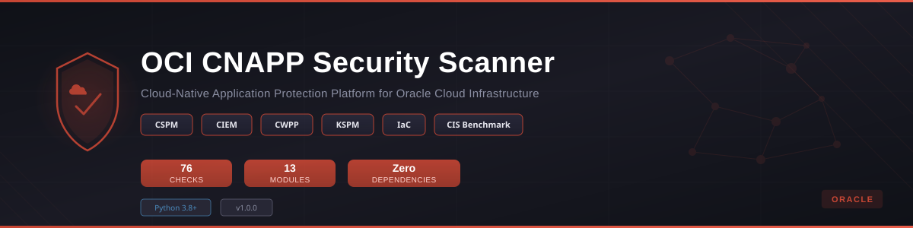

<p align="center">
  
</p>

<p align="center">
  <strong>A Python-based Cloud-Native Application Protection Platform (CNAPP) scanner for Oracle Cloud Infrastructure</strong>
</p>

<p align="center">
  
  
  
  
  
  
</p>

---

## Overview

**OCI CNAPP Security Scanner** is a comprehensive offline security assessment tool that implements a modern Cloud-Native Application Protection Platform (CNAPP) -- combining CSPM, CIEM, CWPP, KSPM, and IaC security scanning into one unified scanner for Oracle Cloud Infrastructure. It analyzes OCI configuration exports (JSON from the `oci` CLI) against the CIS Oracle Cloud Infrastructure Foundations Benchmark v2.0, OCI security best practices, and industry frameworks.

### What is CNAPP?

A Cloud-Native Application Protection Platform (CNAPP) -- as defined by Gartner -- unifies multiple cloud security capabilities into a single platform:

| Pillar | Full Name | What It Protects |
|--------|-----------|-----------------|
| **CSPM** | Cloud Security Posture Management | Infrastructure misconfigurations, compliance |
| **CIEM** | Cloud Infrastructure Entitlement Management | IAM permissions, policies, least privilege |
| **CWPP** | Cloud Workload Protection Platform | Compute, containers, bastion, WAF |
| **KSPM** | Kubernetes Security Posture Management | OKE cluster configuration, RBAC, network policy |
| **IaC** | Infrastructure as Code Security | Terraform state and plan misconfigurations |

This scanner covers **all five pillars** with 76 checks across 13 modules -- zero external dependencies, pure Python 3.8+ stdlib.

---

## Features

- **76 security checks** across 13 specialized modules
- **CIS OCI Foundations Benchmark v2.0** mapping for 40+ checks
- **Offline analysis** -- reads JSON exports, never connects to live OCI environments
- **Interactive HTML dashboard** with severity breakdown and detailed findings
- **Zero dependencies** -- Python 3.8+ standard library only
- **Module selection** -- run all checks or pick specific modules
- **Severity filtering** -- CRITICAL, HIGH, MEDIUM, LOW
- **CI/CD friendly** -- JSON output, exit codes, severity gating

---

## Quick Start

```bash
git clone https://github.com/Krishcalin/OCI-CNAPP-Security-Scanner.git
cd OCI-CNAPP-Security-Scanner

# Run with sample data (includes deliberate misconfigurations)
python oci_scanner.py --data-dir ./sample_data --output report.html

# Filter by severity
python oci_scanner.py --data-dir ./exports --severity HIGH

# Run specific modules
python oci_scanner.py --data-dir ./exports --modules iam network compute oke

# Run only Vault & WAF checks
python oci_scanner.py --data-dir ./exports --modules vault waf bastion
```

---

## CNAPP Modules (13)

### CSPM -- Cloud Security Posture Management (7 modules, 51 checks)

<details>
<summary><strong>Module 1: IAM & Policies</strong> -- 10 checks (CIS 1.x)</summary>

| Check ID | Title | Severity | CIS |
|----------|-------|----------|-----|
| OCI-IAM-001 | Resources in root compartment | CRITICAL | 1.1 |
| OCI-IAM-002 | MFA not enforced for IAM users | CRITICAL | 1.7 |
| OCI-IAM-003 | Overly broad policy statements | HIGH | 1.2 |
| OCI-IAM-004 | API keys older than 90 days | HIGH | 1.8 |
| OCI-IAM-005 | Auth tokens not rotated | HIGH | 1.9 |
| OCI-IAM-006 | Users not in groups | MEDIUM | 1.3 |
| OCI-IAM-007 | No federation configured | MEDIUM | 1.12 |
| OCI-IAM-008 | Admin group has excessive members | HIGH | 1.4 |
| OCI-IAM-009 | Policy allows all-resources in tenancy | HIGH | 1.1 |
| OCI-IAM-010 | No password policy configured | MEDIUM | 1.5 |
</details>

<details>
<summary><strong>Module 2: Networking & VCN</strong> -- 10 checks (CIS 2.x)</summary>

| Check ID | Title | Severity | CIS |
|----------|-------|----------|-----|
| OCI-NET-001 | Default security list allows all egress | HIGH | 2.1 |
| OCI-NET-002 | SSH open to 0.0.0.0/0 | CRITICAL | 2.2 |
| OCI-NET-003 | RDP open to 0.0.0.0/0 | CRITICAL | 2.3 |
| OCI-NET-004 | NSG rules overly permissive | HIGH | 2.4 |
| OCI-NET-005 | Subnets without VCN flow logs | HIGH | 2.5 |
| OCI-NET-006 | Internet gateway on sensitive VCN | MEDIUM | 2.6 |
| OCI-NET-007 | DRG not configured | LOW | -- |
| OCI-NET-008 | Route table misconfigurations | MEDIUM | -- |
| OCI-NET-009 | Service gateway not used | MEDIUM | 2.7 |
| OCI-NET-010 | Unrestricted ICMP ingress | MEDIUM | -- |
</details>

<details>
<summary><strong>Module 3: Compute</strong> -- 8 checks (CIS 3.x)</summary>

| Check ID | Title | Severity | CIS |
|----------|-------|----------|-----|
| OCI-COMP-001 | Shielded Instance Secure Boot disabled | MEDIUM | 3.1 |
| OCI-COMP-002 | Measured Boot disabled | MEDIUM | 3.2 |
| OCI-COMP-003 | In-transit encryption disabled | HIGH | 3.3 |
| OCI-COMP-004 | Instances with public IPs | HIGH | 3.4 |
| OCI-COMP-005 | Legacy images in use | MEDIUM | -- |
| OCI-COMP-006 | Boot volumes without customer-managed keys | MEDIUM | 3.5 |
| OCI-COMP-007 | Instance Metadata Service v1 in use | HIGH | 3.6 |
| OCI-COMP-008 | Monitoring agent not enabled | LOW | -- |
</details>

<details>
<summary><strong>Module 4: Object Storage</strong> -- 6 checks (CIS 5.x)</summary>

| Check ID | Title | Severity | CIS |
|----------|-------|----------|-----|
| OCI-STOR-001 | Public buckets detected | CRITICAL | 5.1 |
| OCI-STOR-002 | Versioning not enabled | MEDIUM | 5.2 |
| OCI-STOR-003 | No lifecycle policies | LOW | -- |
| OCI-STOR-004 | Buckets without customer-managed keys | MEDIUM | 5.3 |
| OCI-STOR-005 | Pre-authenticated requests review | HIGH | 5.4 |
| OCI-STOR-006 | Replication not configured | LOW | -- |
</details>

<details>
<summary><strong>Module 5: Database Security</strong> -- 6 checks</summary>

| Check ID | Title | Severity | CIS |
|----------|-------|----------|-----|
| OCI-DB-001 | ADB without customer-managed encryption | MEDIUM | -- |
| OCI-DB-002 | DB Systems without automated backups | HIGH | -- |
| OCI-DB-003 | MySQL HeatWave without private endpoint | HIGH | -- |
| OCI-DB-004 | Database not in private subnet | HIGH | -- |
| OCI-DB-005 | IAM authentication not enabled for ADB | MEDIUM | -- |
| OCI-DB-006 | Database patch not current | MEDIUM | -- |
</details>

<details>
<summary><strong>Module 6: Logging & Audit</strong> -- 6 checks (CIS 4.x)</summary>

| Check ID | Title | Severity | CIS |
|----------|-------|----------|-----|
| OCI-LOG-001 | Audit log retention below 365 days | HIGH | 4.1 |
| OCI-LOG-002 | VCN flow logs not enabled | HIGH | 4.2 |
| OCI-LOG-003 | Service connector not configured | MEDIUM | 4.3 |
| OCI-LOG-004 | Events rules not configured | HIGH | 4.4 |
| OCI-LOG-005 | No alarms configured | HIGH | 4.5 |
| OCI-LOG-006 | Log groups not organized | LOW | -- |
</details>

<details>
<summary><strong>Module 7: Cloud Guard</strong> -- 5 checks (CIS 4.x)</summary>

| Check ID | Title | Severity | CIS |
|----------|-------|----------|-----|
| OCI-CG-001 | Cloud Guard not enabled | CRITICAL | 4.6 |
| OCI-CG-002 | Detector recipes not configured | HIGH | 4.7 |
| OCI-CG-003 | Responder recipes not configured | HIGH | 4.8 |
| OCI-CG-004 | Security zones not defined | MEDIUM | -- |
| OCI-CG-005 | Unresolved Cloud Guard problems | MEDIUM | -- |
</details>

---

### CWPP -- Cloud Workload Protection (3 modules, 16 checks)

<details>
<summary><strong>Module 8: OKE / Kubernetes (KSPM)</strong> -- 8 checks</summary>

| Check ID | Title | Severity | CIS |
|----------|-------|----------|-----|
| OCI-OKE-001 | Public API endpoint | HIGH | -- |
| OCI-OKE-002 | Network policies not enforced | HIGH | -- |
| OCI-OKE-003 | Pod security standards not applied | MEDIUM | -- |
| OCI-OKE-004 | RBAC not integrated with OCI IAM | HIGH | -- |
| OCI-OKE-005 | Node pool without secure boot | MEDIUM | -- |
| OCI-OKE-006 | Workload identity not configured | HIGH | -- |
| OCI-OKE-007 | Image validation not enabled | MEDIUM | -- |
| OCI-OKE-008 | Node auto-upgrade disabled | MEDIUM | -- |
</details>

<details>
<summary><strong>Module 9: WAF & Edge</strong> -- 4 checks</summary>

| Check ID | Title | Severity | CIS |
|----------|-------|----------|-----|
| OCI-WAF-001 | Load balancers without WAF policy | HIGH | -- |
| OCI-WAF-002 | WAF protection rules not enabled | MEDIUM | -- |
| OCI-WAF-003 | No rate limiting configured | MEDIUM | -- |
| OCI-WAF-004 | No custom WAF rules | LOW | -- |
</details>

<details>
<summary><strong>Module 10: Bastion</strong> -- 4 checks</summary>

| Check ID | Title | Severity | CIS |
|----------|-------|----------|-----|
| OCI-BAST-001 | Bastion service not used | HIGH | -- |
| OCI-BAST-002 | Session limits too permissive | MEDIUM | -- |
| OCI-BAST-003 | Bastion sessions not audit-logged | MEDIUM | -- |
| OCI-BAST-004 | Direct SSH via public IP detected | CRITICAL | -- |
</details>

---

### Encryption & KMS (1 module, 5 checks)

<details>
<summary><strong>Module 11: Vault & KMS</strong> -- 5 checks (CIS 1.x)</summary>

| Check ID | Title | Severity | CIS |
|----------|-------|----------|-----|
| OCI-KMS-001 | Vault keys without rotation | HIGH | 1.10 |
| OCI-KMS-002 | Customer-managed keys not used | MEDIUM | -- |
| OCI-KMS-003 | Vault not replicated | LOW | -- |
| OCI-KMS-004 | Overly broad key access policies | HIGH | -- |
| OCI-KMS-005 | HSM protection level not used | MEDIUM | -- |
</details>

---

### IaC -- Infrastructure as Code Security (1 module, 3 checks)

<details>
<summary><strong>Module 12: Terraform / IaC</strong> -- 3 checks</summary>

| Check ID | Title | Severity | CIS |
|----------|-------|----------|-----|
| OCI-IAC-001 | Terraform state misconfigurations | HIGH | -- |
| OCI-IAC-002 | Terraform plan resource deletions | MEDIUM | -- |
| OCI-IAC-003 | Terraform state stored locally | MEDIUM | -- |
</details>

---

### Compliance (1 module, 1 check)

<details>
<summary><strong>Module 13: CIS Benchmark</strong> -- 1 check</summary>

| Check ID | Title | Severity | CIS |
|----------|-------|----------|-----|
| OCI-CIS-001 | CIS OCI Foundation Benchmark v2.0 summary | LOW | -- |
</details>

---

## CLI Reference

```
usage: oci_scanner.py [-h] --data-dir DATA_DIR [--output OUTPUT]
                      [--severity {CRITICAL,HIGH,MEDIUM,LOW,ALL}]
                      [--modules {iam,network,compute,storage,database,logging,
                                  cloudguard,oke,vault,waf,bastion,iac,cis} ...]
                      [--config CONFIG] [--version]

OCI CNAPP Security Scanner

required arguments:
  --data-dir DATA_DIR   Path to directory with OCI CLI JSON exports

optional arguments:
  --output OUTPUT       Output report filename (default: oci_security_report.html)
  --severity LEVEL      Minimum severity filter: CRITICAL, HIGH, MEDIUM, LOW, ALL (default: ALL)
  --modules MOD [...]   Modules to run (default: all)
  --config CONFIG       Baseline config JSON file for custom thresholds
  --version             Show version and exit
```

### Available Modules

```
CSPM:
  iam          -- IAM & Policies (CIS 1.x)
  network      -- Networking & VCN (CIS 2.x)
  compute      -- Compute (CIS 3.x)
  storage      -- Object Storage (CIS 5.x)
  database     -- Database Security
  logging      -- Logging & Audit (CIS 4.x)
  cloudguard   -- Cloud Guard (CIS 4.x)

CWPP/KSPM:
  oke          -- OKE / Kubernetes Security
  waf          -- WAF & Edge Security
  bastion      -- Bastion Security

Encryption:
  vault        -- Vault & KMS (CIS 1.x)

IaC:
  iac          -- Terraform / IaC Security

Compliance:
  cis          -- CIS OCI Foundation Benchmark Summary

all            -- Run all 13 modules (default)
```

---

## Data Collection

Use the OCI CLI to export configurations from your tenancy. The scanner reads standard JSON exports with `{"data": [...]}` envelope format.

### IAM & Policies

```bash
# Users, Groups, Policies
oci iam user list --compartment-id $TENANCY_OCID --all > iam_users.json
oci iam group list --compartment-id $TENANCY_OCID --all > iam_groups.json
oci iam policy list --compartment-id $TENANCY_OCID --all > iam_policies.json

# API Keys & Auth Tokens
oci iam user api-key list --user-id $USER_OCID > iam_api_keys.json
oci iam auth-token list --user-id $USER_OCID > iam_auth_tokens.json

# Compartments & Tenancy
oci iam compartment list --compartment-id $TENANCY_OCID --all > compartments.json
oci iam authentication-policy get --compartment-id $TENANCY_OCID > password_policy.json

# Identity Federation
oci iam identity-provider list --compartment-id $TENANCY_OCID --protocol SAML2 > identity_providers.json
```

### Networking & VCN

```bash
oci network vcn list --compartment-id $COMPARTMENT_OCID --all > vcns.json
oci network security-list list --compartment-id $COMPARTMENT_OCID --all > security_lists.json
oci network nsg list --compartment-id $COMPARTMENT_OCID --all > network_security_groups.json
oci network subnet list --compartment-id $COMPARTMENT_OCID --all > subnets.json
oci network internet-gateway list --compartment-id $COMPARTMENT_OCID --all > internet_gateways.json
oci network route-table list --compartment-id $COMPARTMENT_OCID --all > route_tables.json
oci network service-gateway list --compartment-id $COMPARTMENT_OCID --all > service_gateways.json
oci network drg-attachment list --compartment-id $COMPARTMENT_OCID --all > drg_attachments.json
```

### Compute

```bash
oci compute instance list --compartment-id $COMPARTMENT_OCID --all > instances.json
oci bv boot-volume list --compartment-id $COMPARTMENT_OCID --availability-domain $AD > boot_volumes.json
oci compute image list --compartment-id $COMPARTMENT_OCID --all > images.json
oci compute vnic-attachment list --compartment-id $COMPARTMENT_OCID --all > vnic_attachments.json
```

### Object Storage

```bash
oci os bucket list --compartment-id $COMPARTMENT_OCID --all > buckets.json
oci os preauth-request list --bucket-name $BUCKET_NAME --namespace $NAMESPACE > preauthenticated_requests.json
```

### Database

```bash
oci db autonomous-database list --compartment-id $COMPARTMENT_OCID --all > autonomous_databases.json
oci db system list --compartment-id $COMPARTMENT_OCID --all > db_systems.json
oci mysql db-system list --compartment-id $COMPARTMENT_OCID --all > mysql_db_systems.json
```

### Logging & Audit

```bash
oci audit config get --compartment-id $TENANCY_OCID > audit_config.json
oci logging log-group list --compartment-id $COMPARTMENT_OCID --all > log_groups.json
oci sch service-connector list --compartment-id $COMPARTMENT_OCID --all > service_connectors.json
oci events rule list --compartment-id $COMPARTMENT_OCID --all > events_rules.json
oci monitoring alarm list --compartment-id $COMPARTMENT_OCID --all > alarms.json
```

### Cloud Guard

```bash
oci cloud-guard configuration get --compartment-id $TENANCY_OCID > cloud_guard_config.json
oci cloud-guard target list --compartment-id $COMPARTMENT_OCID --all > cloud_guard_targets.json
oci cloud-guard detector-recipe list --compartment-id $COMPARTMENT_OCID --all > cloud_guard_detectors.json
oci cloud-guard problem list --compartment-id $COMPARTMENT_OCID --all > cloud_guard_problems.json
oci cloud-guard security-zone list --compartment-id $COMPARTMENT_OCID --all > security_zones.json
```

### OKE / Kubernetes

```bash
oci ce cluster list --compartment-id $COMPARTMENT_OCID --all > oke_clusters.json
oci ce node-pool list --compartment-id $COMPARTMENT_OCID --all > oke_node_pools.json
```

### Vault & KMS

```bash
oci kms management vault list --compartment-id $COMPARTMENT_OCID --all > vaults.json
oci kms management key list --compartment-id $COMPARTMENT_OCID --all > vault_keys.json
```

### WAF & Load Balancers

```bash
oci waf web-app-firewall-policy list --compartment-id $COMPARTMENT_OCID --all > waf_policies.json
oci lb load-balancer list --compartment-id $COMPARTMENT_OCID --all > load_balancers.json
```

### Bastion

```bash
oci bastion bastion list --compartment-id $COMPARTMENT_OCID --all > bastions.json
oci bastion session list --bastion-id $BASTION_OCID --all > bastion_sessions.json
```

### Terraform (for IaC scanning)

```bash
# Copy Terraform state for IaC analysis
cp terraform.tfstate /path/to/exports/

# Or export plan
terraform plan -out=tfplan && terraform show -json tfplan > terraform_plan.json
```

---

## CIS OCI Foundations Benchmark v2.0 Mapping

The scanner maps checks to the CIS Oracle Cloud Infrastructure Foundations Benchmark v2.0:

| CIS Section | Topic | Module | Checks |
|-------------|-------|--------|--------|
| 1.1 | Compartment & Policy | `iam` | OCI-IAM-001, OCI-IAM-009 |
| 1.2 | Policies | `iam` | OCI-IAM-003 |
| 1.3 | User Management | `iam` | OCI-IAM-006 |
| 1.4 | Admin Groups | `iam` | OCI-IAM-008 |
| 1.5 | Password Policy | `iam` | OCI-IAM-010 |
| 1.7 | MFA | `iam` | OCI-IAM-002 |
| 1.8 | API Key Rotation | `iam` | OCI-IAM-004 |
| 1.9 | Auth Token Rotation | `iam` | OCI-IAM-005 |
| 1.10 | KMS Key Rotation | `vault` | OCI-KMS-001 |
| 1.12 | Federation | `iam` | OCI-IAM-007 |
| 2.1 | Security Lists | `network` | OCI-NET-001 |
| 2.2 | SSH Access | `network` | OCI-NET-002 |
| 2.3 | RDP Access | `network` | OCI-NET-003 |
| 2.4 | NSG Rules | `network` | OCI-NET-004 |
| 2.5 | VCN Flow Logs | `network` | OCI-NET-005 |
| 2.6 | Internet Gateway | `network` | OCI-NET-006 |
| 2.7 | Service Gateway | `network` | OCI-NET-009 |
| 3.1 | Secure Boot | `compute` | OCI-COMP-001 |
| 3.2 | Measured Boot | `compute` | OCI-COMP-002 |
| 3.3 | In-Transit Encryption | `compute` | OCI-COMP-003 |
| 3.4 | Public IPs | `compute` | OCI-COMP-004 |
| 3.5 | Boot Volume Encryption | `compute` | OCI-COMP-006 |
| 3.6 | IMDSv2 | `compute` | OCI-COMP-007 |
| 4.1 | Audit Log Retention | `logging` | OCI-LOG-001 |
| 4.2 | VCN Flow Logs | `logging` | OCI-LOG-002 |
| 4.3 | Service Connector | `logging` | OCI-LOG-003 |
| 4.4 | Events Rules | `logging` | OCI-LOG-004 |
| 4.5 | Alarms | `logging` | OCI-LOG-005 |
| 4.6 | Cloud Guard Enabled | `cloudguard` | OCI-CG-001 |
| 4.7 | Detector Recipes | `cloudguard` | OCI-CG-002 |
| 4.8 | Responder Recipes | `cloudguard` | OCI-CG-003 |
| 5.1 | Public Buckets | `storage` | OCI-STOR-001 |
| 5.2 | Versioning | `storage` | OCI-STOR-002 |
| 5.3 | Bucket Encryption | `storage` | OCI-STOR-004 |
| 5.4 | Pre-Authenticated Requests | `storage` | OCI-STOR-005 |

---

## Project Structure

```
OCI-CNAPP-Security-Scanner/
├── oci_scanner.py                  # Main entry point
├── modules/
│   ├── __init__.py
│   ├── base.py                     # DataLoader & BaseAuditor
│   ├── cspm_core.py               # IAM, Network, Compute, Storage auditors
│   ├── cspm_ciem.py               # Database, Logging, Cloud Guard auditors
│   ├── cwpp_iac.py                # OKE, Vault, WAF, Bastion, IaC, CIS auditors
│   └── report_generator.py        # Interactive HTML dashboard report
├── sample_data/                    # 35 demo OCI config exports
│   ├── iam_users.json
│   ├── iam_groups.json
│   ├── iam_policies.json
│   ├── vcns.json
│   ├── security_lists.json
│   ├── instances.json
│   ├── buckets.json
│   ├── oke_clusters.json
│   ├── cloud_guard_config.json
│   ├── terraform.tfstate
│   └── ...                        # 25 more config files
├── docs/
│   └── banner.svg                 # Project banner
├── LICENSE
├── CLAUDE.md
└── README.md
```

---

## How It Works

```
┌──────────────────────────────────────────────────────────────────┐
│                  OCI Configuration Exports                        │
│   oci CLI JSON  .  Terraform State  .  Terraform Plan             │
└────────────────────────────┬─────────────────────────────────────┘
                             │
                  ┌──────────▼──────────┐
                  │    DataLoader        │
                  │  (modules/base.py)   │
                  │  FILE_MAP -> _unwrap │
                  └──────────┬──────────┘
                             │
        ┌────────────────────┼────────────────────┐
        │                    │                     │
 ┌──────▼──────┐    ┌───────▼───────┐    ┌───────▼───────┐
 │    CSPM      │    │    CWPP       │    │  Encryption   │
 │  7 modules   │    │  3 modules    │    │  1 module     │
 │  51 checks   │    │  16 checks    │    │  5 checks     │
 └──────┬──────┘    └───────┬───────┘    └───────┬───────┘
        │                    │                     │
        └────────────────────┼────────────────────┘
                             │
                  ┌──────────▼──────────┐
                  │  + IaC (3 checks)   │
                  │  + CIS (1 check)    │
                  └──────────┬──────────┘
                             │
                  ┌──────────▼──────────┐
                  │  ReportGenerator    │
                  │  HTML Dashboard     │
                  └─────────────────────┘
```

---

## Requirements

- **Python 3.8+**
- **No external dependencies** -- uses only the Python standard library
- OCI CLI (`oci`) required only for exporting configurations (not for the scanner itself)

---

## References

### CIS Benchmarks
- [CIS Oracle Cloud Infrastructure Foundations Benchmark v2.0](https://www.cisecurity.org/benchmark/oracle_cloud)
- [CIS Kubernetes Benchmark](https://www.cisecurity.org/benchmark/kubernetes)

### Oracle Cloud Security
- [OCI Security Best Practices](https://docs.oracle.com/en-us/iaas/Content/Security/Concepts/security_guide.htm)
- [OCI IAM Best Practices](https://docs.oracle.com/en-us/iaas/Content/Identity/Concepts/overview.htm)
- [OCI Cloud Guard](https://docs.oracle.com/en-us/iaas/cloud-guard/home.htm)
- [OKE Security Guide](https://docs.oracle.com/en-us/iaas/Content/ContEng/Concepts/contengclustersbest.htm)
- [OCI Vault & Key Management](https://docs.oracle.com/en-us/iaas/Content/KeyManagement/Concepts/keyoverview.htm)
- [OCI Bastion Service](https://docs.oracle.com/en-us/iaas/Content/Bastion/home.htm)
- [OCI WAF](https://docs.oracle.com/en-us/iaas/Content/WAF/home.htm)

### Industry Frameworks
- [NIST SP 800-53 Rev 5](https://csrc.nist.gov/publications/detail/sp/800-53/rev-5/final)
- [NIST Cybersecurity Framework (CSF) 2.0](https://www.nist.gov/cyberframework)
- [SOC 2 -- Trust Service Criteria](https://www.aicpa.org/interestareas/frc/assuranceadvisoryservices/sorhome)
- [ISO/IEC 27001:2022](https://www.iso.org/standard/27001)

### CNAPP Architecture
- [Gartner -- Market Guide for CNAPP](https://www.gartner.com/en/documents/4017050)
- [Wiz -- What is CSPM](https://www.wiz.io/academy/what-is-cloud-security-posture-management-cspm)
- [Orca -- CWPP, CSPM, CIEM, CNAPP](https://orca.security/resources/blog/cwpp-cspm-ciem-cnapp/)

---

## Legal & Ethical Use

This tool is for **authorized security assessments only**. It performs offline analysis of JSON configuration exports and does not connect to any live OCI environment. Always ensure you have proper authorization before exporting and analyzing cloud configurations. Do not use this tool against infrastructure you do not own or have explicit permission to assess.

---

## License

MIT License -- see [LICENSE](LICENSE).
